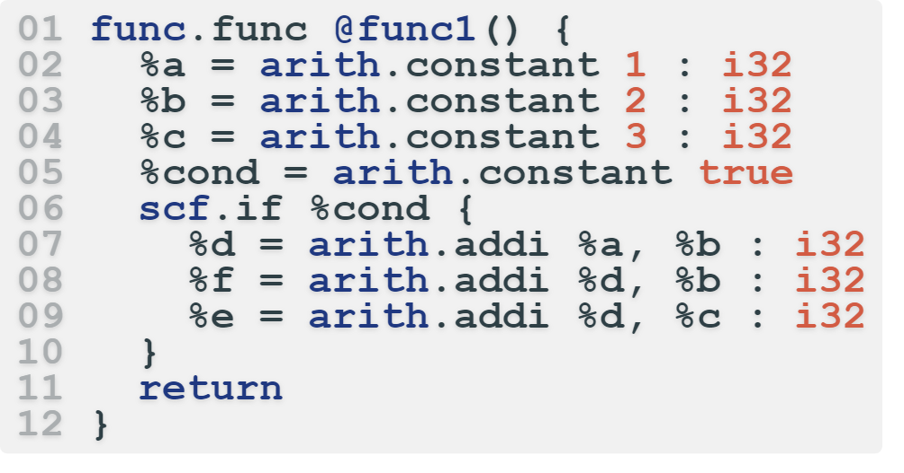
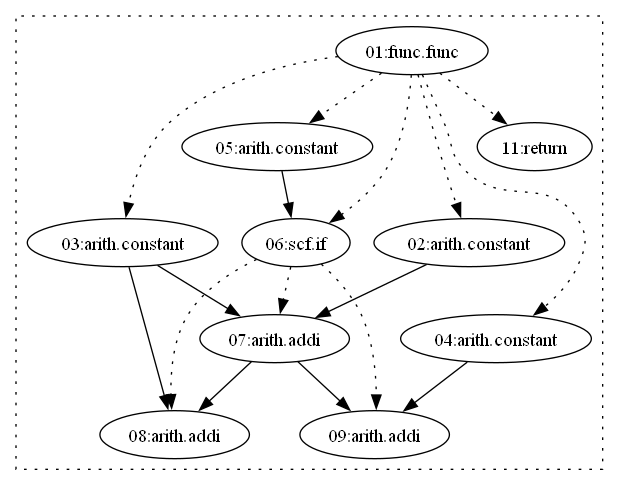
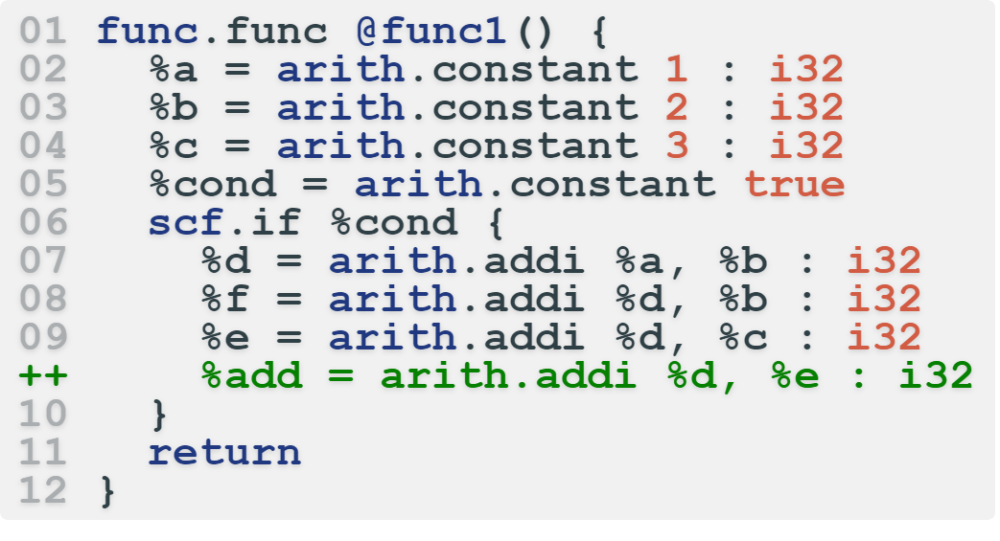
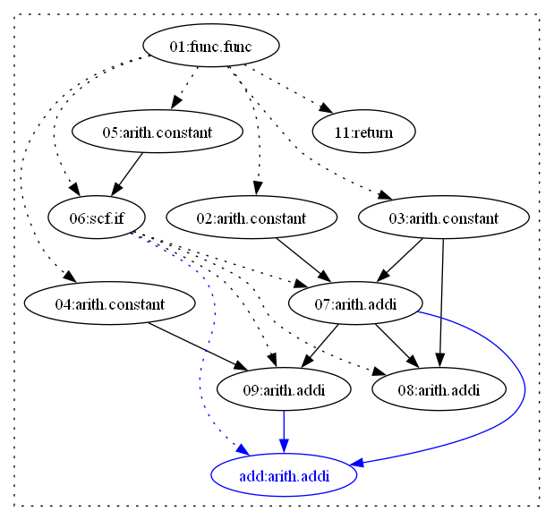
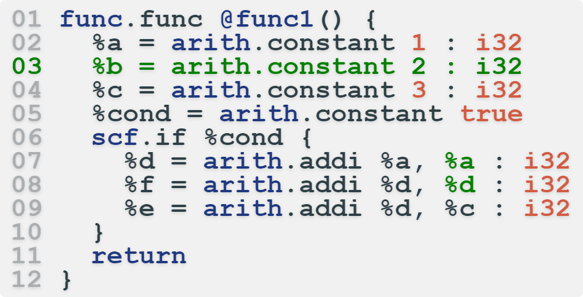
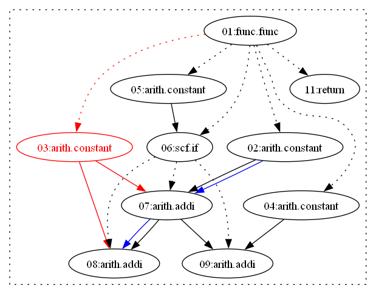
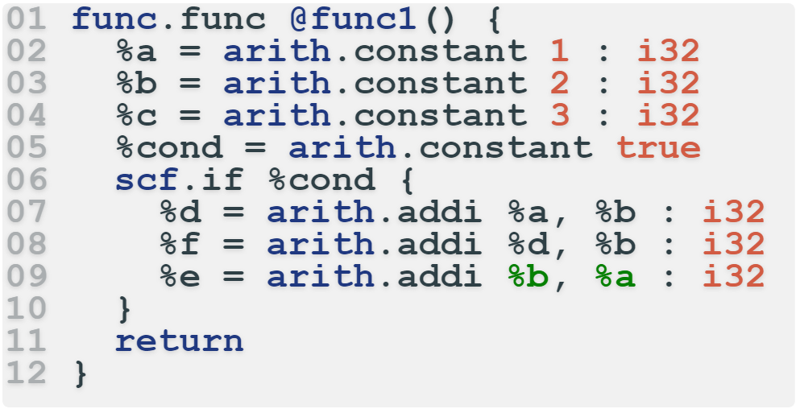
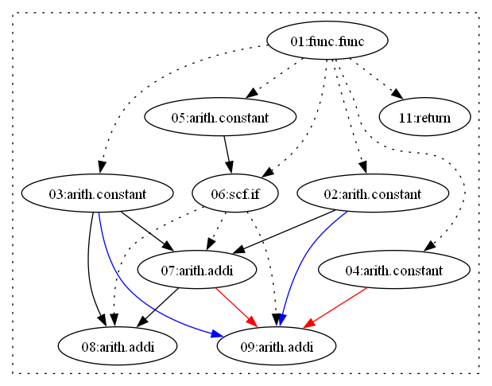
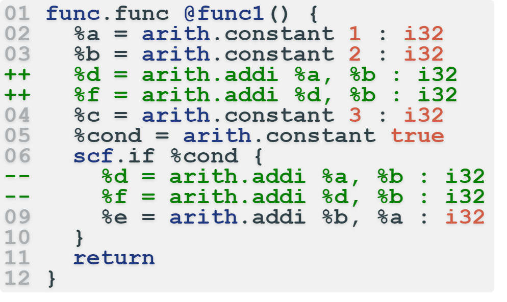
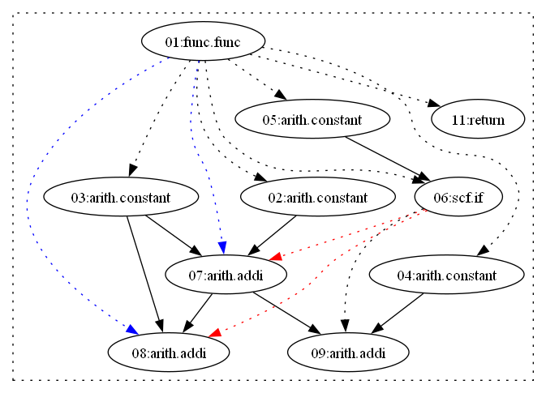

# Mutation Examples

To facilitate comprehension, we've included simple mutation examples here to illustrate how the mutation rules operate, as we had to omit them in the paper due to space limit.

The exmaple program is: 
<div align=center></div>
<div align=center>Figure 1: Example code</div>

The corresponding ODG is:

<div align=center></div>
<div align=center>Figure 2: Example ODG</div>

In the following sections, 
changes in the code are highlighted in green. 
Deleted nodes or edges in ODG are marked in red, 
while added nodes or edges in ODG are marked in blue.

## Node Insertion (R1)

Node insertion (R1) denotes inserting a new random node into the ODG of a given MLIR program and then constructing the dependency edges between it and the existing nodes according to the operands required by the new node. 

Figure 3 and Figure 4 show the example code and ODG of node insertion mutation.
In the example,
the node insertion mutation adds an ```arith.addi``` operation after Line 9. 
This added ```arith.addi``` operation takes ```%d``` (defined at Line 07) and ```%e``` (defined at Line 09) as operands.
In terms of the operation dependency graph, 
the node insertion mutation involves several steps:
1. It generates an operation instance of the ```arith.addi``` operation and establishes the control edge $e^{control}\_{06,add}$ (where line numbers represent corresponding nodes).
2. To ensure the correctness of the mutated code, $e^{control}\_{07,add}$ and $e^{data}\_{09,add}$ are established to provide type-compatible and accessible operands.

<div align=center></div>
<div align=center>Figure 3: Example code of node insertion</div>


<div align=center></div>
<div align=center>Figure 4: Example ODG of node insertion</div>

## Node Deletion (R2)

Node deletion (R2) denotes randomly deleting an existing node from the OGD of a given MLIR program and then updating the data and control dependencies broken by the deletion.

In Figure 5 and Figure 6, 
we illustrate an example code and its corresponding ODG for node deletion mutation.
In this example, 
the node deletion mutation removes the ```arith.constant``` operation at Line 02. 
This deletion necessitates replacing the use of ```%b``` 
(which is defined by the deleted ```arith.constant```), 
specifically in the operands of ```arith.addi``` at Line 07 and ```arith.addi``` at Line 08.
Regarding the operation dependency graph, 
the node deletion mutation involves the following steps:
1. Removal of the ```03:arith.constant``` operation instance from the ODG, along with the associated operation dependency edges: $e^{control}\_{01,03}$, $e^{data}\_{03,07}$, and $e^{data}\_{03,08}$.
3. However, deleting $e^{data}\_{03,07}$ and $e^{data}\_{03,08}$ would make the mutated MLIR program invalid.
4. To address this, the data deletion mutation randomly selects type-compatible and accessible operands and establishes the corresponding data dependency edges: $e^{data}\_{02,07}$ and $e^{data}\_{07,08}$.

<div align=center></div>
<div align=center>Figure 5: Example code of node deletion</div>

<div align=center></div>
<div align=center>Figure 6: Example ODG of node deletion</div>

## Data Dependency Modification (R3)

Data dependency modification (R3) denotes replacing all the nodes that are data depended by a randomly selected node in the ODG of a given MLIR program with other accessible and type-compatible nodes.

In Figure 7 and Figure 8, 
we provide an example code and its ODG for data dependency modification.
The data dependency modification mutation is straightforward.
In this example,
the data dependency modification mutation replaces the operands of ```arith.addi``` at Line 09 with other type-compatible and accessible operands, i,e, ```%b``` and ```%a```.
Concerning the operation dependency graph, 
the data dependency modification mutation replaces existing $e^{data}\_{07,09}$ and $e^{data}\_{04,09}$ with valid data dependency edges, 
i.e., $e^{data}\_{03,09}$ and $e^{data}\_{02,09}$.

<div align=center></div>
<div align=center>Figure 7: Example code of data dependency modification</div>

<div align=center></div>
<div align=center>Figure 8: Example ODG of data dependency modification</div>

## Control Dependency Modification (R4)

Control dependency modification (R4) denotes updating the control dependency of a randomly selected node in the ODG of a given MLIR program, 
while keeping all the data dependencies unchanged. 
Specifically, 
this mutation rule aims to move the operation instance from an inner conditional block to the outer one, 
and thus achieves the modification of the control dependency, 
which can complement the other mutation rules to a large extent.

In Figure 9 and Figure 10, 
we provide an example code and its corresponding operation dependency graph for control dependency modification.
In this example, 
the control dependency modification mutation moves two ```arith.addi``` operations marked at Line -- out of the ```scf.if``` operation at Line 06, 
placing them after the ```arith.constant``` operation at Line 03 (which defines ```%b``` that the two ```arith.addi``` operations use).
Concerning the operation dependency graph, 
the control dependency modification mutation first calculates a data-dependent operation set that provides direct or indirect data (as operands) to the target operation instance (```08:arith.addi```). 
The data-dependent set for ```08:arith.addi``` includes { ```07:arith.addi```, ```03:arith.constant```, ```02:arith.constant``` }.
Then, it checks whether operation instances in the data-dependent set are located in the same block as the target operation instance (```08:arith.addi```). 
After the calculation, we determine that ```07:arith.addi``` is located in the same block as ```08:arith.addi```, 
indicated by $e^{control}\_{06,07} \in E$ and $e^{control}\_{06,08} \in E$.
This implies that the control dependency modification mutation should replace $e^{control}\_{06,07}$ and $e^{control}\_{06,08}$ with $e^{control}\_{01,07}$ and $e^{control}\_{01,08}$ respectively.
However, another issue arises: 
where should the moved statements be located? 
Here, the previously calculated data-dependent set assists again. 
Note that the ```scf.if``` is at Line 06, and the corresponding operation of operation instance ```03:arith.constant``` is at Line 03. 
Thus, the two operations should move to Lines 03-06.

<div align=center></div>
<div align=center>Figure 9: Example code of control dependency modification</div>

<div align=center></div>
<div align=center>Figure 10: Example ODG of control dependency modification</div>
